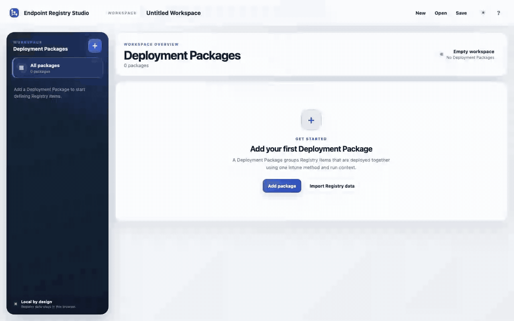
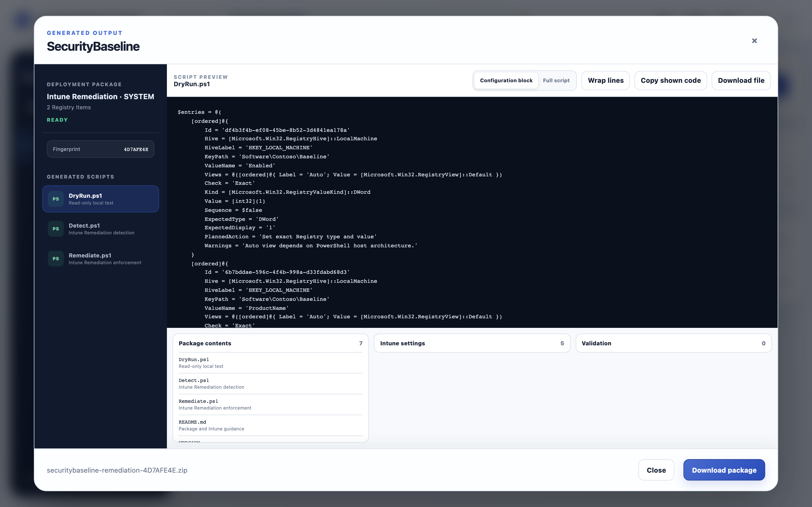

# Endpoint Registry Studio

Endpoint Registry Studio is a client-side web application for authoring Windows Registry desired state and generating PowerShell packages for Microsoft Intune.

Registry files, Workspace data, and generated output stay in the browser. The application has no backend, account system, database, analytics, or telemetry.



## Features

- Organize Registry Items in Deployment Packages.
- Import supported `.reg` files or clipboard content with visible diagnostics.
- Define exact Registry type, value, view, desired state, deletion behavior, and optional Win32 Revert behavior.
- Generate Windows PowerShell 5.1 for Intune Remediation, Platform scripts, and Win32 app source.
- Review scripts before downloading package ZIPs, Workspace JSON, CSV summaries, and documentation.
- Target HKLM or HKCU in logged-on-user and SYSTEM contexts, including signed-in users, existing profiles, and optional Default User handling.

Example Workspaces are available in [`samples/`](samples/README.md).

## Build variants

| Variant          | Artifact                                                                              | Workspace behavior                                                                         |
| ---------------- | ------------------------------------------------------------------------------------- | ------------------------------------------------------------------------------------------ |
| Storage-free web | `dist-web/` and `endpoint-registry-studio-web-<version>.zip`                          | Memory only; explicit import/export; reload discards unexported work                       |
| Self-hosted      | `dist-docker/`, Docker image, and `endpoint-registry-studio-selfhosted-<version>.zip` | Autosave and restore in origin-private browser storage, using OPFS with IndexedDB fallback |

The storage-free build is checked by `npm run verify:storage-free` and a browser suite that verifies persistent storage APIs are not used. The self-hosted build can clear its stored Workspace from the Privacy dialog.

Versioned GitHub releases include both ZIP files and `SHA256SUMS`. Each ZIP includes `LICENSE` and `THIRD_PARTY_NOTICES.md`; the same files are served by the container image.

Release and generator metadata use the same version source. Release 1.0.0 therefore reports generator contract 1.0.0 in About, Workspace/package JSON, generated scripts, documentation, and `VERSION` files.

## Quick start

Node.js 22 or newer is required.

```bash
npm ci
npm run dev
```

Build both variants:

```bash
npm run build
```

Run the published container:

```bash
docker compose pull
docker compose up -d
```

Open `http://localhost:8080`. Set `HOST_PORT` to use another host port.

Compose defaults to the latest stable image (`latest`). Set `IMAGE_TAG` to an exact release such as `1.0.0` when the deployment must remain pinned.



## Hosting

Both builds use relative asset paths and work at a domain root or subdirectory. Keep `config.json` beside `index.html`.

- Static web host: upload the storage-free release bundle (FTPES, SFTP, or rsync) and serve it over HTTPS.
- Docker and the self-hosted ZIP serve the persistent browser-storage variant.

Hosted deployments may provide branding and footer links through validated runtime configuration. Deployment-specific legal pages and links are supplied without changing application code.

See [Docker and static hosting](docs/DOCKER_AND_HOSTING.md) and [GHCR deployment](docs/GHCR_DEPLOYMENT.md).

## Security

- Imported files and runtime configuration are treated as untrusted data.
- Downloads are created locally with Blob URLs and only after user action.
- Detect and DryRun scripts are read-only; mutating roles are deterministic and idempotent.
- Generated PowerShell requires no external modules, downloads, or network requests.
- Generated scripts should be reviewed and tested on representative non-production Windows devices before rollout.

See [Security and privacy architecture](docs/SECURITY.md) and the [security policy](SECURITY.md).

## Documentation

- [Architecture](docs/ARCHITECTURE.md)
- [Workspace schema](docs/WORKSPACE_SCHEMA.md)
- [PowerShell output](docs/POWERSHELL_OUTPUT.md)
- [Testing](docs/TESTING.md)
- [Contributing](CONTRIBUTING.md)

## License

[MIT](LICENSE)
